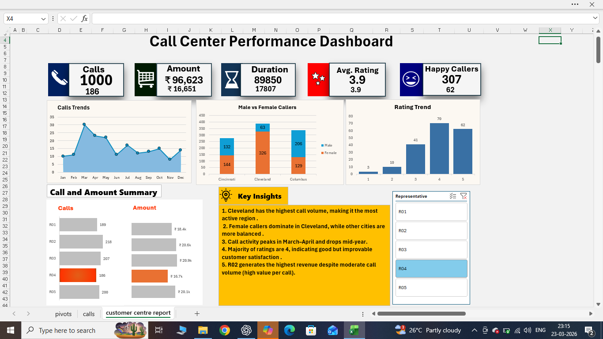

📊 Call Center Performance Dashboard (Excel)

📌 Built as part of my Data Analytics Portfolio

🔍 Overview

This project is an interactive Call Center Dashboard built using Microsoft Excel to analyze call trends, customer behavior, and regional performance.

📸 Dashboard Preview

🚀 Features
📞 Call Trends Analysis (Monthly)
👥 Male vs Female Caller Comparison
⭐ Customer Rating Analysis
📊 Call & Revenue Summary
🌍 Regional Performance Breakdown
🎯 Interactive Filters (Representative-wise)
📊 Key Insights
Cleveland has the highest call volume, making it the most active region
Female callers dominate in Cleveland
Call activity peaks in March–April and drops mid-year
Majority ratings are 4 (good but improvable satisfaction)
R02 generates highest revenue despite moderate call volume
🛠 Tools Used
Microsoft Excel
Pivot Tables
Charts & Visualization
Data Cleaning
🎯 Skills Demonstrated
Data Analysis
Dashboard Design
Business Insight Generation
Data Visualization
📂 Project Structure

call-center-dashboard-excel
│── call_center_dashboard.xlsx
│── README.md
│── images/
│ └── dashboard_preview.png

🙋‍♂️ Author

Aditya Shrivastav
Aspiring Data Analyst
